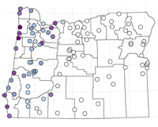

```{r set-options, echo=FALSE}
options(width = 105)
knitr::opts_chunk$set(dev='png', dpi=300, cache=TRUE)
pdf.options(useDingbats = TRUE)
```


**GEOG 4/595: Winter 2019, 2:00-3:50 MW, 206 Condon Hall**

- Topic:  Visualization and Data Analysis
- Instructor:  Pat Bartlein, bartlein@uoregon.edu, 154 Condon, 6-4967

**Course overview:**  Phenomena describable by multiple variables arise in many subfields of physical and human geography and related disciplines.  The focus of this course is on the analysis and display of multivariate geographical data by traditional multivariate methods and by newer methods of scientific visualization.  The R data-analysis and computing environment will be used.

**Course materials:** (See pull-down menus above.)  

- Overview:  Course overview, syllabus, etc.
- Topics:  Individual lectures and discussion topics
- Exercises:  Exercises and related material
- Resources:  Readings, data sets, etc.

<p><span style="color: #15B93D;"><b>This is the course web page for GEOG 4/595, Winter 2019.</b></span></p>
  
The GitHub repository for these pages, containing \*.md, \*.Rmd, \*.html, and data files is at:  [https://github.com/pjbartlein/GDA_Source/](https://github.com/pjbartlein/GDA_Source/)

**Department of Geography, Univeristy of Oregon -- 
[https://geography.uoregon.edu](https://geography.uoregon.edu)**